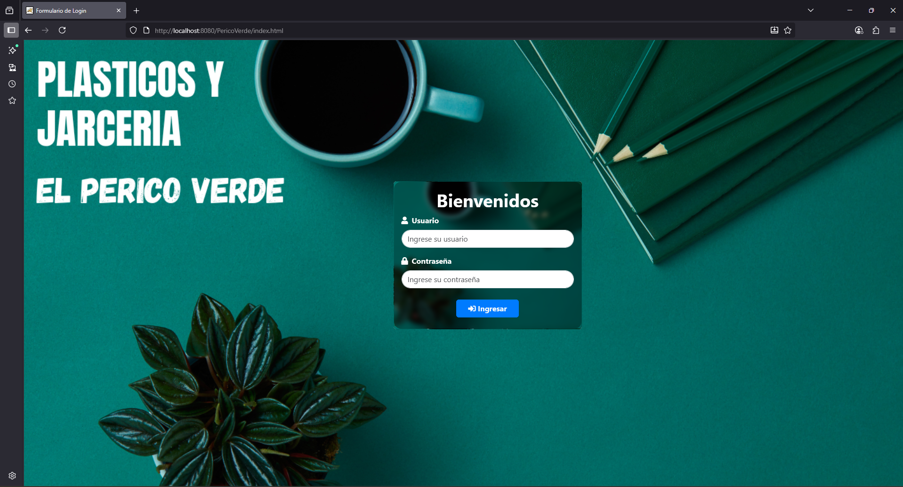
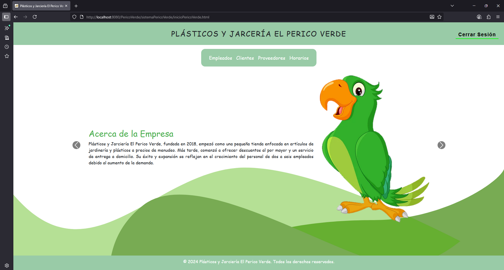
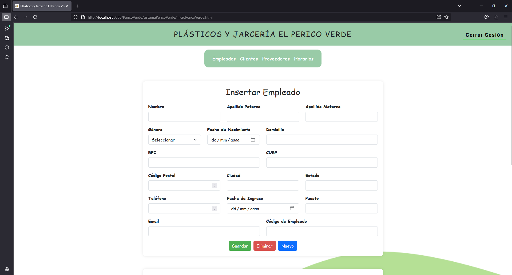
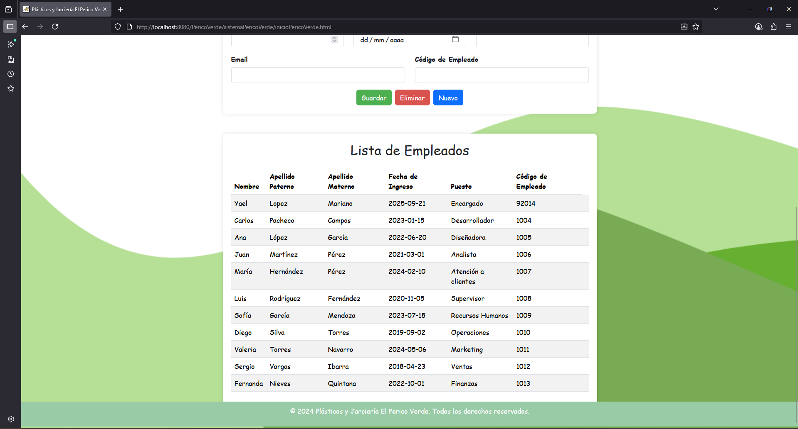
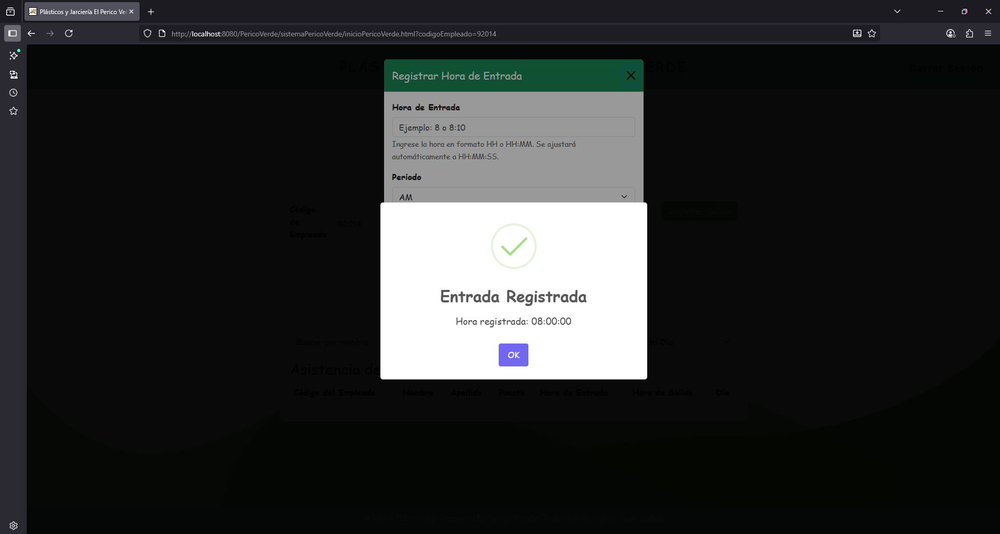
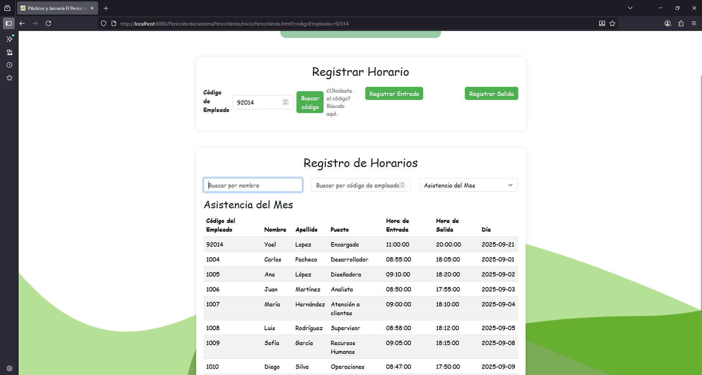

Plásticos Perico Verde — Gestión de Entradas y Salidas

Sistema de gestión empresarial desarrollado en Java con APIs REST para administrar clientes, empleados, proveedores y asistencias (horarios), además del control de entradas y salidas. Incluye frontend web con HTML, CSS y Bootstrap y persistencia en MySQL.

🚀 Tecnologías principales

Backend: Java (Jersey / JAX-RS), Servlet/JSP, JDBC

REST: Endpoints tipo CRUD (JSON)

BD: MySQL (scripts de creación, vistas, procedimientos e inserts)

Frontend: HTML, CSS, Bootstrap, JavaScript

Servidor: Apache Tomcat (WAR)

IDE: NetBeans

📦 Módulos del sistema

Usuarios/Login: autenticación básica

Clientes: registro, edición, consulta y baja

Proveedores: catálogo y administración

Empleados: registro, códigos de empleado y contacto

Asistencias/Horarios: registro de entradas y salidas

Dashboard: acceso a los módulos principales

🧭 Arquitectura

Modelo (POJOs): org.pericoVerde.model.*

Controladores (DAO/Lógica): org.pericoVerde.controller.*

REST (JAX-RS): org.pericoVerde.rest.*

Persistencia: org.pericoVerde.bd.ConexionMySQL

Web (UI): /web/sistemaPericoVerde/*

🔌 Endpoints REST

Base: http://localhost:8080/PericoVerde/api/

Login

POST /login → { usuario, password }

Clientes

GET /clientes — GET /clientes/{id}

POST /clientes — PUT /clientes/{id} — DELETE /clientes/{id}

Proveedores

GET /proveedores — CRUD completo

Empleados

GET /empleados — CRUD completo

Asistencias

GET /asistencias?fecha=YYYY-MM-DD

POST /asistencias (codigoEmpleado, fecha, horaEntrada, horaSalida)

⚙️ Configuración y despliegue

Crear la base de datos en MySQL con los scripts de BD/BD FINAL pericoV/.

Actualizar credenciales en ConexionMySQL.java.

Generar el WAR (dist/PericoVerde.war) y desplegarlo en Tomcat.

Acceder desde: http://localhost:8080/PericoVerde/

🧪 Pruebas rápidas
# Listar clientes
curl -X GET http://localhost:8080/PericoVerde/api/clientes

# Crear cliente
curl -X POST http://localhost:8080/PericoVerde/api/clientes \
  -H "Content-Type: application/json" \
  -d '{"nombre":"Ana","apellido_paterno":"López","apellido_materno":"García","genero":"F"}'

## 📸 Capturas de pantalla

| Login | Menú | Formulario |
|---|---|---|
|  |  |  |

| Lista General | Registro de Entrada | Listado Entradas/Salidas |
|---|---|---|
|  |  |  |

🔒 Seguridad

Autenticación básica de usuarios/login

Validación de entradas en APIs

👤 Autor

Yael López Mariano
Proyecto empresarial: Plásticos Perico Verde
Stack: Java, REST, MySQL, HTML, CSS, Bootstrap, JS
